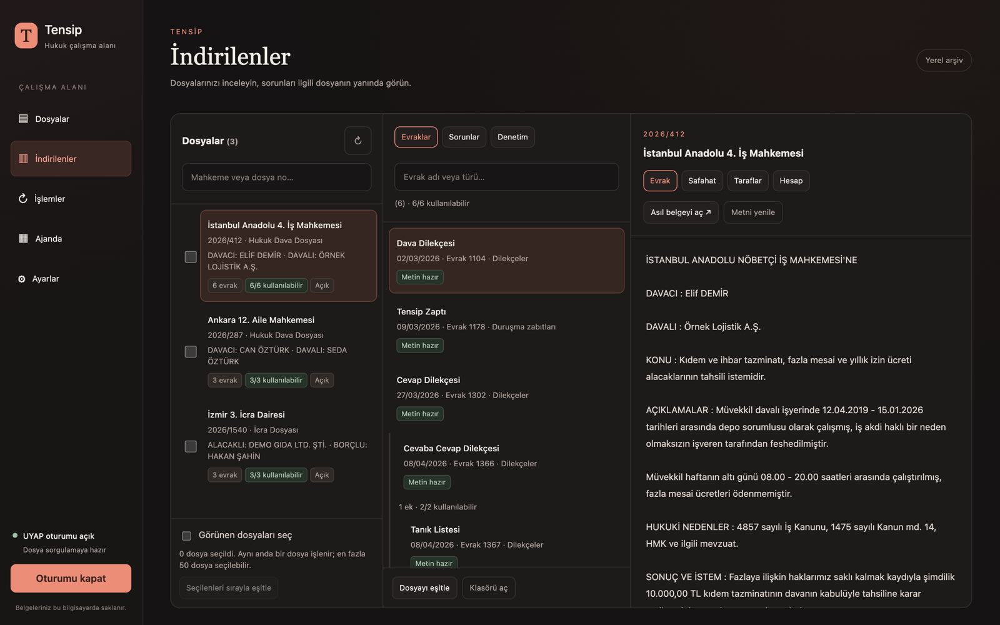
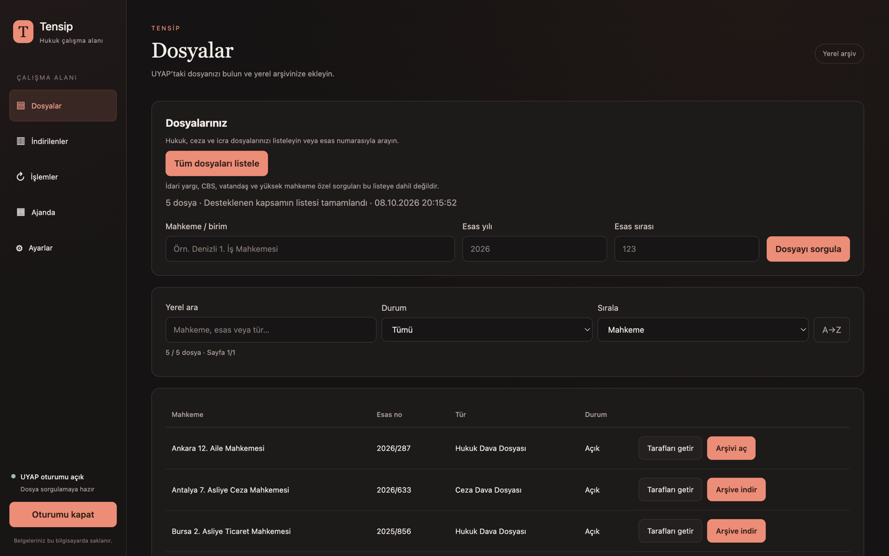
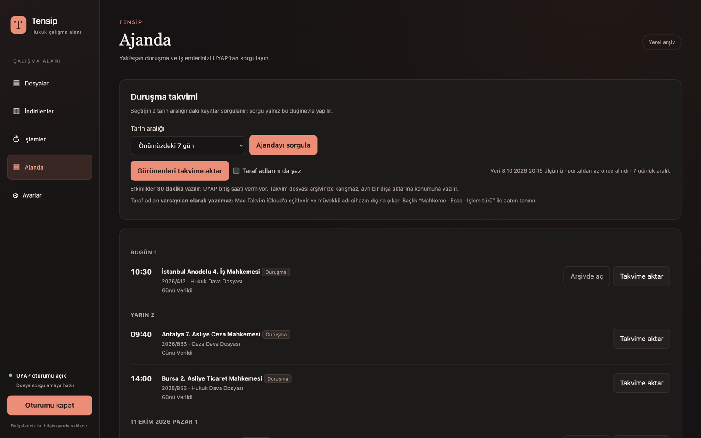
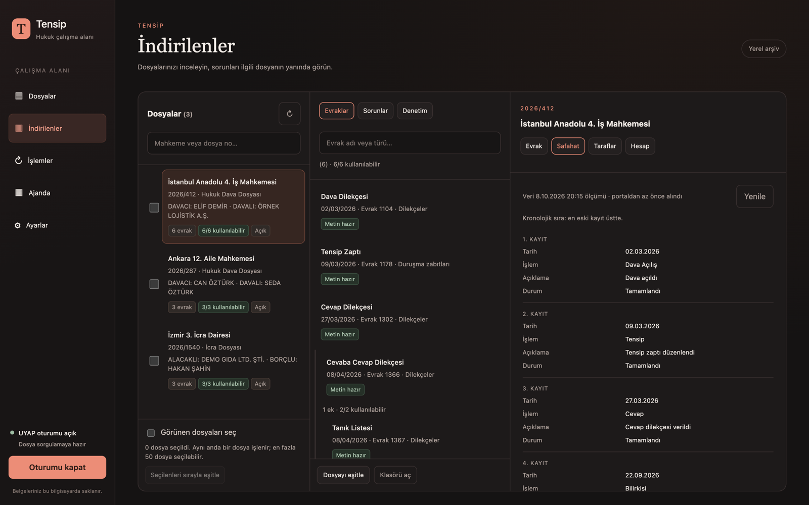

<p align="center"></p>

# Tensip

**Proje sayfası:** [avfatihsozer.com/projeler/tensip](https://avfatihsozer.com/projeler/tensip) · English: [README.en.md](README.en.md)

Tensip, UYAP Avukat Portalı'ndaki dava dosyalarınızı kendi bilgisayarınızda düzenli bir arşive indiren, bu arşivi portalla eşitleyen ve evrakları masaüstünde okunur hâlde gösteren açık kaynaklı bir yardımcı uygulamadır.

> **Tensip resmî bir uygulama değildir.** Adalet Bakanlığı, UYAP ya da herhangi bir baro ile bağlantısı yoktur; onlar tarafından geliştirilmemiş, onaylanmamış ve desteklenmemektedir.



## Ne yapar

- **Dosya listesi:** Vekili olduğunuz hukuk, ceza ve icra dosyalarını mahkeme, yıl ve sıra girmeden listeler.
- **Arşiv ve eşitleme:** Seçtiğiniz dosyanın evraklarını yerel bir klasöre indirir, sonraki eşitlemelerde yalnızca yeni ya da değişmiş evrakları getirir.
- **Önizleme:** UDF ve metin katmanlı PDF evrakları uygulamanın içinde metin olarak gösterir.
- **Dosya ayrıntısı:** Safahat, taraflar ve hesap bilgisini dosya ekranında gösterir.
- **Ajanda:** Yaklaşan duruşma ve keşifleri listeler ve macOS Takvim'e aktarır.
- **Denetim ve onarım:** Arşivdeki eksik, bozuk ya da mükerrer kayıtları bulur ve güvenle düzeltilebilenleri onarır.
- **Üç arayüz:** macOS uygulama penceresi, tarayıcıdan açılan yerel pano (`http://127.0.0.1:4747`) ve JSON çıktı veren komut satırı (`tensip`).

<table>
  <tr>
    <td width="33%"><a href=".github/ekran/dosyalar.png"></a></td>
    <td width="33%"><a href=".github/ekran/ajanda.png"></a></td>
    <td width="33%"><a href=".github/ekran/safahat.png"></a></td>
  </tr>
  <tr>
    <td align="center"><sub>Dosya listesi</sub></td>
    <td align="center"><sub>Ajanda</sub></td>
    <td align="center"><sub>Safahat</sub></td>
  </tr>
</table>

Ekran görüntülerindeki dosyalar ve taraflar uydurmadır.

## Ne yapmaz

Tensip UYAP'a evrak ya da dilekçe göndermez ve imza atmaz; portalda yalnızca sorgu yapar ve belge indirir. Arşiviniz ve oturum bilgileriniz bilgisayarınızda kalır, uygulama UYAP dışında hiçbir sunucuya bağlanmaz.

## Portal yükü ve sorumluluk

Avukat Portalı kullanıcı sözleşmesi, programla sisteme olağan dışı yük bindirmeyi yasaklıyor ve ihlal hâlinde portal erişimi engellenebiliyor. Tensip bu yüzden portala aynı anda tek istek gönderir, portalın kendi sınırlarına uyar ve şu frenleri uygular:

| Fren | Varsayılan | Bayrak |
|---|---|---|
| İki istek arasındaki bekleme | 3 sn ile 5 sn arasında, her istekte rastgele seçilir | `--istek-aralik MS` (alt sınır), `--istek-sapma MS` |
| Günlük portal isteği | 500 (giriş doğrulaması ve oturum yenileme dâhil) | `--gunluk-istek-tavan N` |
| Günlük dosya işi (eşitleme, klonlama) | 40 | `--gunluk-tavan N` |

Günlük sayaçlar İstanbul saatiyle gece yarısı sıfırlanır; tavan dolunca istek gönderilmez ve eşitleme ertesi gün kaldığı yerden sürer.

Bu sınırlar hesabınızın güvende kalacağını garanti etmez; kullanımın sorumluluğu size aittir.

## Gereksinimler

| Gereksinim | Ne için |
|---|---|
| macOS | Masaüstü penceresi (motor ve komut satırı da yalnızca macOS'ta denendi) |
| Node.js 22 veya üstü | Motor, komut satırı, derleme ve testler |
| Python 3 | Motorun kilit yardımcısı |
| Chrome, Brave ya da Edge | e-Devlet ile portal girişi |
| Xcode komut satırı araçları | `.app` paketini derlemek (`xcode-select --install`) |
| `pdftotext` (isteğe bağlı) | PDF evraklardan metin çıkarmak (`brew install poppler`) |

## Kurulum

```bash
git clone https://github.com/afsozer/tensip.git
cd tensip
./kur.sh
```

`kur.sh` projeyi derler, testleri çalıştırır ve `tensip` ile `tensipd` komutlarını kurar. Masaüstü uygulaması için:

```bash
./uygulama/uygulama-kur.sh
```

## Kullanım

Girişi uygulama penceresinin sol altındaki düğmeyle başlatın; açılan tarayıcıda e-Devlet adımlarını tamamladığınızda Tensip oturumu devralır. Komut satırından:

```bash
tensipd baslat                      # motoru ve yerel panoyu başlatır
tensip giris --cdp                  # tarayıcıda portal girişini açar
tensip davalarim --birim "Denizli 1. Asliye Hukuk Mahkemesi" --yil 2026 --sira 1
tensip klonla --birim "Denizli 1. Asliye Hukuk Mahkemesi" --esas 2026/1
tensip esitle --dava "Denizli 1. Asliye Hukuk Mahkemesi 2026-1"
tensip durusmalar --gun 7           # önümüzdeki haftanın duruşmaları
tensip --help                       # bütün komutlar ve kullanım satırları
tensipd durdur
```

## Veriler nerede durur

| Konum | İçerik |
|---|---|
| `~/Documents/Tensip/` | Dava arşivi (konumu `tensipd baslat --kok <dizin>` ile değişir) |
| `~/.config/tensip/` | Ayarlar, oturum ve iş geçmişi |

## Geliştirme

```bash
npm ci
npm test        # sahte portala karşı derler ve test eder
```

Gerçek UYAP'a bağlanmadan denemek için uydurma dosyalarla dolu bir tanıtım ortamı var:

```bash
npm run build && node bin/demo.mjs 4848    # http://127.0.0.1:4848
```

`src/` motoru, portal istemcisini ve komut satırını, `web/` yerel panoyu, `uygulama/` macOS penceresini içerir.

## Lisans

Tensip [AGPL-3.0-or-later](LICENSE) ile lisanslanmıştır; değiştirilmiş bir sürümü dağıtan ya da ağ üzerinden sunan, kaynak kodunu aynı lisansla paylaşmak zorundadır.

Telif hakkı © 2026 Av. Alpaslan Fatih Sözer
